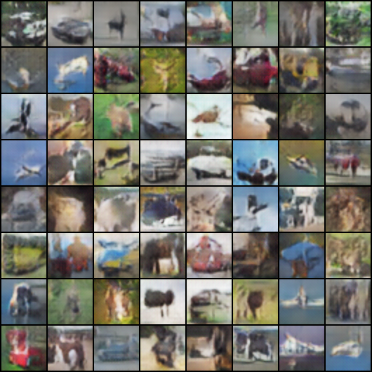

# DCGAN (Deep Convolution Generative Adversarial Networks)

This script implements the paper *[Unsupervised Representation Learning with Deep Convolutional Generative Adversarial Networks](http://arxiv.org/abs/1511.06434)*.

## Usage
Run `python3 main.py` to start training GAN.

## Structure
- `data_loader.py`: dataset setting and data loader.
- `models.py`: discriminator and generator network model.
- `params.py`: parameters for the training process.
- `utils.py`: some useful fuctions for training.

## Result

After 20 epochs training on CFAIR-10, the generator can sample as following:



But when we continue training, the discriminator may get very low loss, and then the generator wil stuck at a fixed loss value.

```
Epoch [24/25] Step [200/782]:d_loss=2.160674767992532e-07 g_loss=27.614051818847656 D(x)=2.160674767992532e-07 D(G(z))=0.0
Epoch [24/25] Step [210/782]:d_loss=6.410500191122992e-06 g_loss=27.623014450073242 D(x)=6.410500191122992e-06 D(G(z))=0.0
Epoch [24/25] Step [220/782]:d_loss=1.5441528375959024e-06 g_loss=27.62175750732422 D(x)=1.5441528375959024e-06 D(G(z))=0.0
Epoch [24/25] Step [230/782]:d_loss=3.24100881243794e-07 g_loss=27.62472152709961 D(x)=3.24100881243794e-07 D(G(z))=0.0
...
```

The result sample image becomes:


But after a while, everything gets right:

```
Epoch [25/25] Step [10/782]:d_loss=0.32297325134277344 g_loss=8.964262962341309 D(x)=0.3229268193244934 D(G(z))=4.6418874262599275e-05
Epoch [25/25] Step [20/782]:d_loss=0.006471103988587856 g_loss=7.038626194000244 D(x)=0.0035153746139258146 D(G(z))=0.002955729141831398
Epoch [25/25] Step [30/782]:d_loss=0.17143061757087708 g_loss=12.035135269165039 D(x)=0.17115993797779083 D(G(z))=0.0002706760715227574
Epoch [25/25] Step [40/782]:d_loss=0.21678031980991364 g_loss=11.419050216674805 D(x)=0.004731819964945316 D(G(z))=0.2120485007762909
```

The sample image recovers:


That indicates that the training process of DCGAN is unstable. Thus we need WGAN.

## Improvement
You can use [some tips and tricks](https://github.com/soumith/ganhacks) to improve the original DCGAN. The following tricks maybe work:
- Avoid Sparse Gradients: ReLU, MaxPool
- Use Soft and Noisy Labels
- Add noise to inputs, decay over time
- Use Dropouts in G in both train and test phase

Or just try WGAN!
